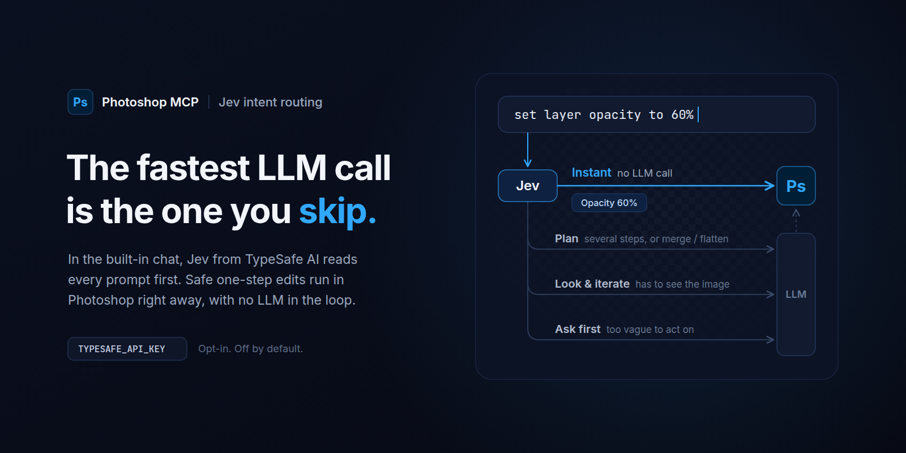
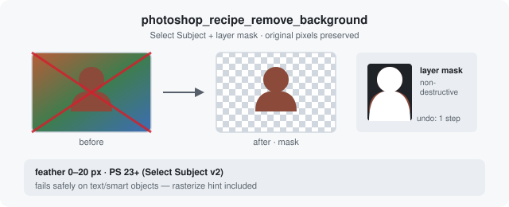
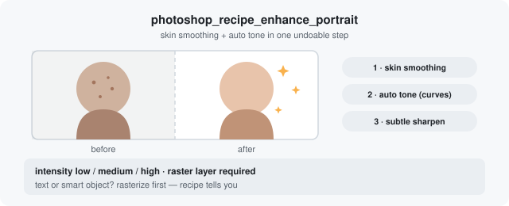
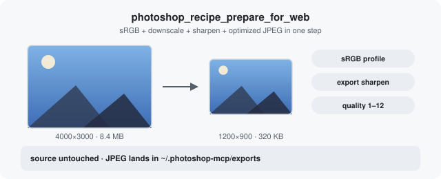
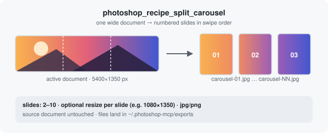

# Photoshop MCP

<p align="center">
  <a href="https://github.com/alisaitteke/photoshop-mcp">
    
  </a>
</p>

**Languages:** English · [简体中文](README.zh-CN.md) · [Español](README.es.md) · [Deutsch](README.de.md) · [日本語](README.ja.md) · [Türkçe](README.tr.md) · **[Website](https://photoshop-mcp.com/)**

[](https://www.npmjs.com/package/@alisaitteke/photoshop-mcp)
[](https://github.com/alisaitteke/photoshop-mcp/releases)
[](docs/standalone-ui.md#action-plan-beta)
[](#new-instant-edits-with-jev)
[](https://opensource.org/licenses/MIT)
[](https://www.typescriptlang.org/)
[]()
[](https://registry.modelcontextprotocol.io)
[](https://mcptoplist.com/server/io.github.alisaitteke%2Fphotoshop-mcp)
[](https://photoshop-mcp.com/)

[](https://glama.ai/mcp/servers/alisaitteke/photoshop-mcp)

**Chat with Photoshop like a colleague.** Describe what you want in plain words —
"remove this background", "resize these for Instagram" — and your AI assistant
does the clicking for you. Works with Cursor, Claude, or the built-in chat
window. No code, no scripts, no IDE required.

> **Note:** This is an unofficial, community-maintained project and is not affiliated with or endorsed by Adobe Inc.

## New: instant edits with Jev

<p align="center">
  <a href="docs/standalone-ui.md#jev-intent-routing-experimental-opt-in">
    
  </a>
</p>

Not every prompt needs a language model. The built-in chat window can now ask
**Jev**, [TypeSafe AI](https://typesafe.ai)'s System One model, where each
message should go before any LLM runs. When Jev is confident you asked for one
of 26 safe commands and recipes (undo, opacity, blend mode, remove background,
color grade, split carousel, …), or a short chain of them like "black and white,
then opacity 50", it runs in Photoshop straight away: no LLM call, no LLM
tokens. Anything else, and hard-to-undo steps like merge or flatten, goes to the
Action Plan.

```bash
TYPESAFE_API_KEY=... npx -p @alisaitteke/photoshop-mcp ui
```

Experimental and opt-in. Without the key the UI works exactly as before and
nothing is sent to TypeSafe; with it, prompts also go to `api.typesafe.ai`.
Routes, thresholds and the off switch:
[`docs/standalone-ui.md`](docs/standalone-ui.md#jev-intent-routing-experimental-opt-in).

## What can it do?

- ✂️ **Remove backgrounds** — subject isolated with a clean, editable mask
- 👤 **Retouch portraits** — skin smoothing, tone fixes, dodge & burn setup
- 🌐 **Export for web & social** — sRGB, sharpened, correctly sized for Instagram, X, and more
- 🎞️ **Make carousels** — split one wide design into seamless, numbered slides
- 💧 **Watermark in bulk** — a whole folder of photos in one go, originals untouched
- 🎨 **Color grade & more** — film looks, sky replacement, generative fill (Adobe account required)
- ⏪ **Stay safe** — every multi-step "recipe" is a single undo step in Photoshop

Under the hood: 132 tools (115 atomic + 17 one-step recipes) — full list in
[`docs/available-tools.md`](docs/available-tools.md).

## Try saying

```
Remove the background from this portrait — keep it editable with a mask.
```



```
Enhance this portrait — smooth the skin and fix the tones, medium intensity.
```



```
Prepare this design for web, then export Instagram and X post variants.
```



```
Split this wide banner into a 5-slide seamless Instagram carousel.
```



More recipes (batch watermark, passport photos, CSV-driven cards, mockups, …) and
pre-engineered prompt templates: [`docs/prompt-layer.md`](docs/prompt-layer.md).

## Get started

You need **Photoshop running** (Windows or macOS, any version 2012+) and **Node.js 18+**.

### Option 1 — Easiest: the built-in chat window

```bash
npx -p @alisaitteke/photoshop-mcp ui
```

A chat window opens in your browser. Sign in with an AI provider API key — or
reuse your existing **Claude Code** / **Gemini CLI** account, no key needed.


Details, providers, Action Plan (API key or CLI account), and security notes:
[`docs/standalone-ui.md`](docs/standalone-ui.md).

### Option 2 — Inside your AI app (Cursor, Claude, VS Code)

**Cursor (shows the Photoshop logo in the MCP list):** install the plugin from **Customize → Plugins**, or search the [Cursor Marketplace](https://cursor.com/marketplace) for `photoshop-mcp` once it is listed. That package still launches `npx -y @alisaitteke/photoshop-mcp`; the plugin manifest is what supplies the icon.

Until the Marketplace listing is live, copy `.cursor-plugin/`, `mcp.json`, and `assets/` into `~/.cursor/plugins/local/photoshop-mcp` and reload the window — details in [CONTRIBUTING.md](CONTRIBUTING.md#cursor-marketplace). The Install-in-Cursor button and a raw `mcp.json` entry still work, but they show a generic icon.

[](https://cursor.com/en/install-mcp?name=photoshop&config=eyJjb21tYW5kIjoibnB4IiwiYXJncyI6WyIteSIsIkBhbGlzYWl0dGVrZS9waG90b3Nob3AtbWNwIl19)
[](https://vscode.dev/redirect/mcp/install?name=photoshop&config=%7B%22command%22%3A%22npx%22%2C%22args%22%3A%5B%22-y%22%2C%22%40alisaitteke%2Fphotoshop-mcp%22%5D%7D)

Claude Code:

```bash
claude mcp add photoshop -- npx -y @alisaitteke/photoshop-mcp
```

Or add this to your MCP client's config (Cursor, Claude Desktop, …):

```json
{
  "mcpServers": {
    "photoshop": {
      "command": "npx",
      "args": ["-y", "@alisaitteke/photoshop-mcp"]
    }
  }
}
```

## How it works

1. **You type** what you want in plain language.
2. **The AI plans** the steps, checking the document state first.
3. **Photoshop executes** — each recipe lands as one undoable step.

Something went wrong? The AI reads the structured error and knows what to try
next. Common fixes: [`docs/troubleshooting.md`](docs/troubleshooting.md).

## Documentation

- [Available tools](docs/available-tools.md) — all 132 tools with parameters
- [Standalone UI](docs/standalone-ui.md) — providers, auth modes, Action Plan, security
- [Prompt layer](docs/prompt-layer.md) — prompt templates and recipes
- [Architecture](docs/architecture.md) — how the bridge works under the hood
- [Development](docs/development.md) — build from source, tests

## Contributing

Contributions are welcome! Please read [CONTRIBUTING.md](CONTRIBUTING.md) before opening a PR.

## ❤️ Contributors & Credits

Thanks to all our contributors!

<a href="https://github.com/alisaitteke/photoshop-mcp/graphs/contributors"></a>

## Maintainer

Built by **[Ali Sait Teke](https://alisait.com)** — [GitHub](https://github.com/alisaitteke) · [LinkedIn](https://www.linkedin.com/in/alisait/).

## License

MIT

Anonymous, aggregated usage analytics are collected by default and can be
disabled anytime — details in [`docs/anonymous-usage-analytics.md`](docs/anonymous-usage-analytics.md).
